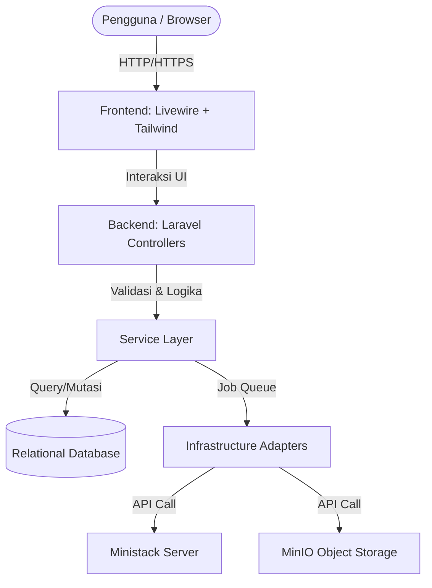

# Dokumen Arsitektur Sistem (High-Level & Detailed Architecture)

## 1. System Architecture

Sistem CloudPet mengadopsi arsitektur terpusat berbasis **Monolith Modular** dengan pendekatan _Layered Architecture_ (Arsitektur Berlapis). Pendekatan ini memisahkan tanggung jawab antara pengelolaan antarmuka, logika bisnis inti, dan integrasi simulator infrastruktur.

Berikut adalah diagram blok interaksi komponen secara menyeluruh:



## 2. Component Breakdown

Untuk memastikan kode program tetap dapat dipelihara (_maintainable_) dan diuji (_testable_), sistem dibagi menjadi lapisan-lapisan berikut:

### A. Presentation Layer

- **Teknologi**: Laravel Blade & Laravel Livewire.
- **Tanggung Jawab**: Merender komponen antarmuka pengguna secara dinamis dan menangani kondisi _state_ pada _frontend_ (seperti menampilkan status _loading_ saat _provisioning_ berjalan). Lapisan ini dilarang keras melakukan kueri langsung ke database atau memanggil API pihak ketiga.

### B. Application Layer

- **Teknologi**: Laravel HTTP Controllers, Request Validator, & Middleware.
- **Tanggung Jawab**: Menerima permintaan HTTP dari komponen Livewire, mengeksekusi validasi aturan masukan (form validation), memastikan pengguna terautentikasi dan memiliki hak akses (Otorisasi via Middleware), serta mengembalikan respons yang sesuai.

### C. Service Layer (Domain Logic)

- **Teknologi**: PHP Classes di bawah nama ruang (_namespace_) `app/Services/`.
- **Tanggung Jawab**: Pusat pengendali logika bisnis utama aplikasi. Lapisan ini berinteraksi dengan database melalui Eloquent Model dan memanggil fungsi eksternal melalui _Infrastructure Contracts_.
- `ComputeService.php`: Mengelola siklus hidup VM (inisialisasi status, perubahan daya server, terminasi).
- `StorageService.php`: Mengatur alokasi nama bucket dan penugasan hak akses pengguna.
- `DatabaseService.php`: Mengelola alur pembentukan klaster database baru.

### D. Infrastructure Layer (Adapters & Repositories)

- **Teknologi**: PHP Classes di bawah nama ruang `app/Infrastructure/`.
- **Tanggung Jawab**: Mengimplementasikan antarmuka (_interface_) abstrak yang didefinisikan oleh sistem. Lapisan ini mengubah instruksi internal aplikasi menjadi format yang dipahami oleh _engine_ luar (Ministack dan MinIO). Jika di masa depan simulator diganti dengan penyedia layanan cloud asli (AWS/GCP), perubahan hanya terjadi pada lapisan ini.

### E. Persistence Layer

- **Teknologi**: Database Relasional (MySQL / PostgreSQL) via Laravel Eloquent ORM.
- **Tanggung Jawab**: Menyimpan status akhir dari semua sumber daya virtual, konfigurasi paket (_Plans_), catatan transaksi penagihan, serta seluruh log aktivitas dan galat.

---

## 3. Struktur Direktori Proyek (Panduan Developer)

Developer wajib mengikuti struktur direktori berikut untuk menjaga konsistensi implementasi _Design Pattern_:

```text
app/
├── Contracts/                         # Tempat menyimpan seluruh Interface/Abstraksi
│   ├── ComputeIntegrationInterface.php
│   └── StorageIntegrationInterface.php
├── Http/
│   ├── Controllers/                   # Controller untuk rute konvensional & Admin
│   ├── Livewire/                      # Komponen interaktif untuk Dasbor User
│   └── Middleware/                    # Validasi sesi dan otorisasi keamanan
├── Infrastructure/
│   └── Adapters/                      # Implementasi konkret dari Kontrak/Interface
│       ├── MinioStorageAdapter.php
│       └── MinistackCloudAdapter.php
├── Jobs/                              # Pekerjaan asinkron yang dimasukkan ke Queue
│   ├── ProvisionComputeInstance.php
│   └── DeployManagedDatabase.php
├── Models/                            # Eloquent Models (User, Plan, ComputeInstance, dll)
├── Providers/
│   └── AppServiceProvider.php         # Tempat binding antara Interface dan Adapter
└── Services/                          # Logika bisnis murni (Domain Services)
    ├── ComputeService.php
    ├── DatabaseService.php
    └── StorageService.php

```

---

## 4. Cloud Simulation Architecture (Integrasi Ministack & MinIO)

Ministack bertindak sebagai _orchestration layer_ ringan yang mensimulasikan lingkungan cloud nyata.

### Alur Detail Pembuatan Komputasi (Create Compute Instance Flow):

1. **Pemicu**: Pengguna memilih paket komputasi dan menekan tombol _Create_.
2. **Service Layer**: `ComputeService` memvalidasi kuota pengguna, lalu membuat data di tabel `compute_instances` dengan status `provisioning`.
3. **Queue Dispatch**: Pekerjaan asinkron `ProvisionComputeInstance` dimasukkan ke dalam antrean (_queue_).
4. **Adapter Execution**: Di dalam antrean, `MinistackCloudAdapter` melakukan panggilan API ke endpoint Ministack dengan membawa spesifikasi parameter _Plan_.
5. **Simulated Provisioning**: Server Ministack menerima instruksi, mengalokasikan ruang komputasi virtual, mengaktifkan sistem operasi, dan menghasilkan alamat IP.
6. **Save Metadata**: Adapter menerima respons sukses dari Ministack, kemudian memperbarui status instans di database menjadi `running` dan menyimpan alamat IP yang didapatkan.

---

## 5. Communication Flow (7 Langkah Transaksi Utama)

Setiap permintaan pengelolaan sumber daya infrastruktur wajib melewati siklus komunikasi berikut:

```text
[User Request]
      │
      ▼
1. Validation ─────────► (Mengecek validitas input form & keunikan nama)
      │
      ▼
2. Auth & Policy ──────► (Memastikan pengguna memiliki hak akses & saldo/fitur plan)
      │
      ▼
3. Local Persistence ──► (Mencatat status awal 'pending/provisioning' ke DB utama)
      │
      ▼
4. Queue Dispatch ─────► (Memasukkan proses ke antrean agar UI tidak membeku)
      │
      ▼
5. Engine Execution ───► (Adapter memanggil API Ministack / MinIO secara asinkron)
      │
      ▼
6. State Update ───────► (Memperbarui status akhir sumber daya ke DB & simpan kredensial)
      │
      ▼
7. Observability Log ──► (Memicu log pada activity_logs & resource_state_logs)

```

---

## 6. Spesifikasi Desain Pola Kode (Design Pattern Implementation)

Untuk memudahkan proses coding, berikut adalah contoh spesifikasi rancangan _Interface_ dan _Service Container Binding_ yang harus diikuti oleh developer:

### Kontrak Antarmuka Penyimpanan Objek (`app/Contracts/StorageIntegrationInterface.php`):

```php
<?php

namespace App\Contracts;

interface StorageIntegrationInterface
{
    public function createBucket(string $bucketName): bool;
    public function deleteBucket(string $bucketName): bool;
    public function setBucketPolicy(string $bucketName, array $policyRules): bool;
}

```

### Implementasi Adapter MinIO (`app/Infrastructure/Adapters/MinioStorageAdapter.php`):

```php
<?php

namespace App\Infrastructure\Adapters;

use App\Contracts\StorageIntegrationInterface;
use Aws\S3\S3Client; // Menggunakan SDK yang kompatibel dengan MinIO

class MinioStorageAdapter implements StorageIntegrationInterface
{
    protected $s3Client;

    public function __construct() {
        // Inisialisasi koneksi ke server MinIO berdasarkan .env
    }

    public function createBucket(string $bucketName): bool {
        // Logika SDK: $this->s3Client->createBucket(['Bucket' => $bucketName]);
        return true;
    }

    public function deleteBucket(string $bucketName): bool {
        // Logika SDK untuk menghapus bucket
        return true;
    }

    public function setBucketPolicy(string $bucketName, array $policyRules): bool {
        // Logika menerapkan kebijakan S3/MinIO Policy
        return true;
    }
}

```

### Pendaftaran di Service Provider (`app/Providers/AppServiceProvider.php`):

```php
<?php

namespace App\Providers;

use Illuminate\Support\ServiceProvider;
use App\Contracts\StorageIntegrationInterface;
use App\Infrastructure\Adapters\MinioStorageAdapter;

class AppServiceProvider extends ServiceProvider
{
    public function register()
    {
        // Dependency Injection: Ketika StorageIntegrationInterface dipanggil, injeksikan MinioStorageAdapter
        $this->app->bind(StorageIntegrationInterface::class, MinioStorageAdapter::class);
    }
}

```

---

## 7. Monitoring & Observability Architecture

Sistem menerapkan arsitektur pemantauan pasif berbasis _Event-Driven_:

```text
[User Action / Status Change]
              │
              ▼
    (Fires Laravel Event)
              │
              ▼
   [ResourceStateChanged] ───► [LogToDatabaseListener] ───► Simpan ke `resource_state_logs`
              │
              ▼
   (If error occurs) ────────► [SystemErrorListener] ────► Simpan ke `system_error_logs`

```

Setiap perubahan status dari _Engine Integration_ wajib memicu _Event Listener_ bawaan Laravel untuk memastikan data audit trail terisi tanpa mengotori berkas utama di dalam _Service Layer_.

---

## 8. Scalability & Resiliency (Penanganan Beban & Kegagalan)

- **Asynchronous Processing**: Operasi API eksternal tidak boleh dijalankan langsung di dalam siklus _Request-Response_ HTTP normal. Seluruh pembuatan komputasi, database, dan alokasi penyimpanan wajib menggunakan komponen `Laravel Jobs` yang berjalan di latar belakang menggunakan driver antrean seperti Redis atau Database.
- **Retry Mechanisms**: Karena koneksi jaringan ke server simulator (Ministack/MinIO) bisa saja mengalami gangguan sesaat, properti `$tries` pada Laravel Job harus disetel sebanyak `3` kali dengan jeda waktu (_backoff_) bertahap sebelum pekerjaan tersebut dinyatakan benar-benar gagal.
- **Fault Isolation**: Kegagalan pada koneksi modul simulator tidak boleh merusak fungsionalitas dasar aplikasi web (seperti fitur login, manajemen profil, atau peninjauan invoice transaksi). Kegagalan orkestrasi diisolasi sepenuhnya di dalam lapisan _Infrastructure Layer_.
