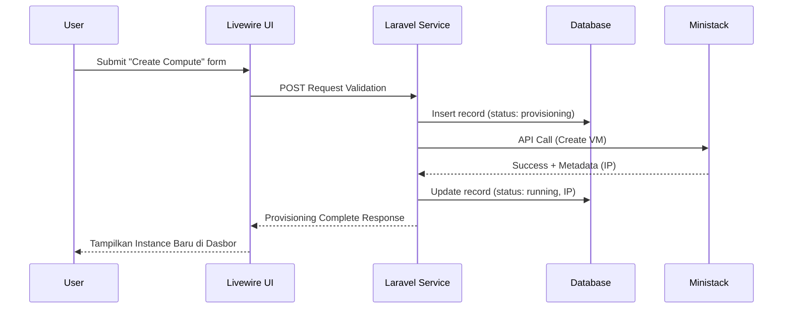
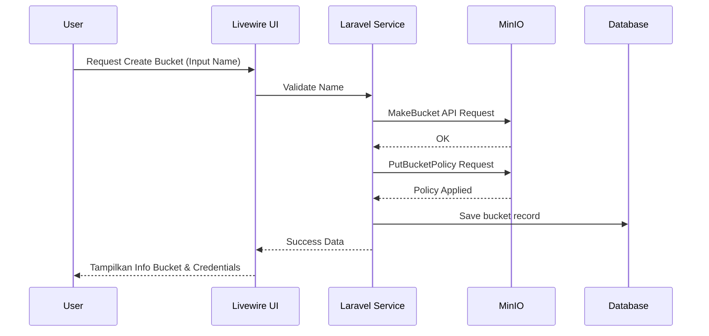
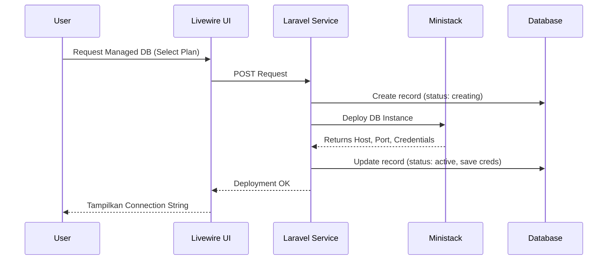

# Dokumen Use Case Sistem

## 1. Actors

Sistem CloudPet dirancang untuk dioperasikan oleh dua peran utama:

| Actor     | Description                                                                                                                                    |
| :-------- | :--------------------------------------------------------------------------------------------------------------------------------------------- |
| **User**  | Pengguna/pelanggan terdaftar yang menggunakan platform untuk menyewa, mengelola, dan memonitor sumber daya cloud.                              |
| **Admin** | Administrator sistem yang mengelola paket layanan (_Plans_), memantau log sistem, meninjau transaksi, dan mengawasi operasional infrastruktur. |

---

## 2. Use Case Catalog

Terdapat 19 fungsi utama di dalam sistem yang dikelompokkan menjadi 5 modul:

**Authentication & Accounts**

- UC-01: Mendaftar Akun Baru (Register)
- UC-02: Melakukan Login & Logout
- UC-03: Mengelola Profil & Pengaturan Keamanan (termasuk 2FA)
- UC-04: Melihat Tagihan / Transaksi (Billing Transactions)

**Compute (via Ministack)**

- UC-05: Melihat Daftar Compute Instance yang dimiliki
- UC-06: Melakukan _Provisioning_ (Membuat) Compute Instance baru
- UC-07: Mengubah status Instance (Start, Stop, Restart)
- UC-08: Menghapus Compute Instance (Terminasi)

**Storage (via MinIO)**

- UC-09: Melihat daftar Storage Bucket
- UC-10: Membuat Storage Bucket baru
- UC-11: Menghapus Storage Bucket

**Database (via Ministack)**

- UC-12: Melihat daftar Managed Database
- UC-13: Membuat/Menyewa Managed Database baru
- UC-14: Menghapus Managed Database

**Administration & Monitoring**

- UC-15: Mengelola (Create, Read, Update, Delete) Data _Plans_ (Paket Layanan)
- UC-16: Melihat Log Aktivitas Pengguna (_Activity Logs_)
- UC-17: Memantau Perubahan Status Resource (_Resource State Logs_)
- UC-18: Memantau Log Error Sistem (_System Error Logs_)
- UC-19: Mengelola Data Pengguna & Transaksi Tagihan

---

## 3. Detailed Critical Flow

### A. Compute Instance Creation (UC-06)

- **Objective**: Mengalokasikan peladen virtual (VPS) baru untuk pengguna berdasarkan _Plan_ yang dipilih.
- **Preconditions**: Pengguna sudah _login_ dan memiliki saldo atau metode pembayaran yang valid.
- **Trigger**: Pengguna menekan tombol "Create Instance", memilih spesifikasi, dan melakukan konfirmasi.
- **Main Flow**:
  1. Antarmuka UI mengirimkan data formulir ke _Backend_.
  2. _Backend_ memvalidasi ketersediaan dan spesifikasi dengan tabel `plans`.
  3. _ComputeService_ membuat rekaman berstatus `provisioning` di tabel `compute_instances`.
  4. _Job Queue_ mentransmisikan permintaan _provisioning_ melalui _Ministack Adapter_ ke server Ministack.
  5. Ministack mengalokasikan sumber daya komputasi dan mengembalikan data metadata (seperti alamat IP).
  6. _Backend_ memperbarui tabel `compute_instances`, mengubah status menjadi `running`, dan menyimpan metadata.
- **Alternative Flow**: Jika kapasitas di zona Ministack sedang penuh, sistem mengantre ulang tugas (_re-queue_) dan memberitahu pengguna tentang estimasi waktu tunggu.
- **Error Condition**: Jika Ministack gagal merespons atau mengembalikan status _error_, _Backend_ mengubah status instance menjadi `failed` dan mencatat detail galat di tabel `system_error_logs`.
- **Postcondition**: Instance baru muncul di dasbor pengguna dalam kondisi aktif beserta alamat IP publik/privatnya.

### B. Storage Bucket Creation (UC-10)

- **Objective**: Menyediakan wadah penyimpanan objek (S3-compatible) baru bagi pengguna.
- **Preconditions**: Pengguna berada dalam kondisi _login_.
- **Trigger**: Pengguna memasukkan nama _bucket_ yang unik dan menekan "Create Bucket".
- **Main Flow**:

1. UI meneruskan permintaan ke _StorageService_.
2. _Backend_ mengeksekusi request HTTP melalui MinIO SDK/Adapter ke server MinIO (`MakeBucket`).
3. _Backend_ menetapkan kebijakan akses (_IAM/Bucket Policy_) agar pengguna memiliki otorisasi penuh pada _bucket_ tersebut.
4. Sistem menyimpan detail konfigurasi _bucket_ di tabel `storage_buckets`.

- **Alternative Flow**: Jika nama _bucket_ sudah digunakan secara global pada _cluster_ MinIO, API akan menolak permintaan; UI meminta pengguna memasukkan nama lain.
- **Error Condition**: Terjadi _timeout_ saat koneksi ke MinIO. Status direkam di `system_error_logs` dan proses pembuat _bucket_ dibatalkan.
- **Postcondition**: Sistem mengembalikan informasi _bucket_ beserta instruksi konfigurasi _Access Key_ dan _Secret Key_ ke dasbor pengguna.

### C. Database Creation (UC-13)

- **Objective**: Melakukan _deployment_ Managed Database (DBaaS) mandiri untuk pengguna.
- **Preconditions**: Pengguna telah memilih _Plan_ spesifikasi database (contoh: PostgreSQL 14 - 2GB RAM).
- **Trigger**: Pengguna menekan tombol "Create Database".
- **Main Flow**:

1. _DatabaseService_ membuat rekaman di tabel `managed_databases` dengan status awal `creating`.
2. _Backend_ mendelegasikan tugas ke Ministack untuk membuat instans database yang terisolasi.
3. Ministack mengonfigurasi mesin database, mengalokasikan memori, dan menghasilkan kredensial (host, port, user, password).
4. Ministack mengembalikan detail koneksi tersebut ke _Backend_.
5. _Backend_ mengubah status rekaman database menjadi `active` dan menyimpan detail koneksi dengan aman.

- **Alternative Flow**: Jika _engine_ atau versi database yang dipilih tidak didukung oleh versi Ministack saat itu, sistem akan langsung menolak sebelum permintaan dikirim.
- **Error Condition**: Jika pembuatan skema pada server Ministack gagal (misal kehabisan _storage_), status instans diatur menjadi `failed`.
- **Postcondition**: Pengguna dapat melihat _Connection String_ pada dasbor mereka.

---

## 4. Recovery Scenario

Untuk menjaga keandalan (_reliability_) sistem, implementasi arsitektur cloud ini menyertakan beberapa skenario pemulihan untuk menangani anomali saat proses _provisioning_:

- **Provisioning Timeout & Retry**:
  Karena proses _provisioning_ komputasi dan database di Ministack dapat memakan waktu, interaksi dilakukan secara asinkron (menggunakan antrean). Jika batas waktu (_timeout_) terlampaui tanpa respons, pekerja latar belakang (_Job Workers_) akan mencoba mengulang permintaan (_Retry_) maksimal 3 kali sebelum menetapkan status kegagalan.
- **Rollback mechanism**:
  Jika terjadi kegagalan parsial (misalnya: _bucket_ MinIO berhasil dibuat tetapi gagal saat menerapkan _Policy_), sistem akan menjalankan skrip _rollback_ yang menghapus sumber daya yang baru dibuat tersebut agar tidak menjadi entitas tak bertuan (_orphaned resource_). Status di database relasional akan diatur menjadi `failed`.
- **Cleanup Resource**:
  Terdapat _scheduler_ (cron job) mingguan yang mencocokkan sinkronisasi data antara rekam jejak di database utama (MySQL/PostgreSQL) dengan status riil pada Ministack dan MinIO. Sumber daya yang berjalan di _engine_ simulasi namun tidak memiliki referensi pemilik yang sah di tabel aplikasi akan dihapus otomatis (_cleanup_).
